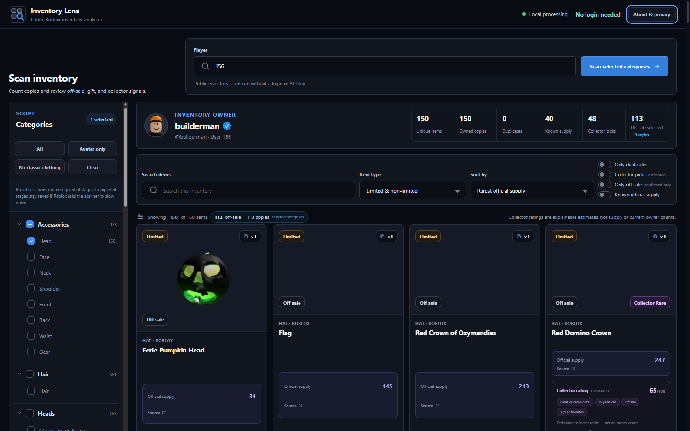
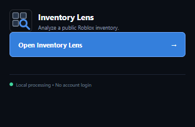

# Inventory Lens

Public Roblox inventory analyzer

> Inventory Lens is an independent project and is not affiliated with, endorsed by, or sponsored by Roblox Corporation.

Inventory Lens analyzes a player's public Roblox inventory. It counts exact public asset instances, groups duplicate copies, and adds public catalog, thumbnail, gift-history, and collector-context metadata without requiring a Roblox API key or sign-in.

Inventory Lens has two delivery targets: a Manifest V3 extension for Chromium-based browsers and a Vercel-hosted web build. The extension requests supported public data directly from Roblox and Fandom. The web build uses stateless, same-origin Vercel Functions that proxy only allowlisted Roblox and Fandom request shapes. Neither build includes an Inventory Lens account, application database, telemetry, advertising, secrets, or account-changing functionality.

## Extension and web builds

The interface and public-data analysis are shared, but the network paths are different:

| Build | How public data is requested | Installation |
| --- | --- | --- |
| Manifest V3 extension | Direct browser requests to the documented Roblox and Fandom hosts, with credentials omitted. | Load `dist` unpacked or install a reviewed extension release. |
| Vercel web build | Browser requests to same-origin `/api/*`; stateless Vercel Functions forward only allowlisted request shapes to Roblox or Fandom. | Deploy `dist-web` and the root `api/*.ts` Functions through Vercel. |

In both builds, validated Roblox avatar and item images load directly from RBXCDN in the browser. See [VERCEL_DEPLOY.md](VERCEL_DEPLOY.md) before publishing the hosted build.

## Screenshots

The release-validation screenshots use publication-safe public data and contain no login state or credentials.





## What it does

- Accepts a Roblox username, `@username`, numeric user ID, or profile URL.
- Checks whether the selected inventory is public before scanning it.
- Counts distinct asset copies using Roblox `userAssetId` values.
- Scans 54 selectable leaf categories, with all supported categories selected initially.
- Loads selected categories sequentially and can add newly selected categories to the current result.
- Includes public bundles and created places alongside asset inventory records.
- Groups copies of the same item and exposes instance IDs, serials, and acquisition dates when Roblox supplies them.
- Enriches results with public Roblox catalog details and thumbnails.
- Labels official limited or collectible supply separately from other metrics.
- Shows Fandom-reported historical purchases only when an exact catalog ID match is available.
- Connects gift rewards to their source gift when strict item-description evidence is available.
- Provides collector-context scoring for old, off-sale, event, promotion, gift, and other distribution signals.
- Filters by category, name, exact Roblox creator, duplicate status, sale state, limited status, known metrics, and collector classification.
- Sorts by known official supply, copies owned, acquisition date, collector score, or name.
- Builds a shareable bordered graphic from the scanned player's full-body avatar and up to 18 user-selected inventory items.
- Lets the user edit the headline, subtitle, every item caption, and a configurable bottom bar; reorder selections; choose landscape/square/portrait; and download a local PNG.
- Offers seven built-in Graphic Builder backgrounds: **Midnight Texture** (default), **Neon Grid**, **Royal Purple**, **Sunset Ember**, **Arctic Blue**, **Emerald Matrix**, and **Clean Black**.
- Bottom-bar blocks can show an editable custom value and label, the selected categories' confirmed off-sale item or copy total, a manual off-sale number, optional display-only USD/crypto/custom currency text, and optional selected-item or owned-copy counts.

## Important metric definitions

Inventory Lens keeps unlike measurements separate:

- **Copies owned** is the number of distinct public inventory instances Roblox returns for this player.
- **Official supply** is a positive Roblox `totalQuantity` for a limited or collectible item.
- **Fandom purchases** is a historical purchase figure reported on a matching Roblox Fandom catalog page. It is not a current owner count.
- **Source gift purchases** is the historical purchase figure for a gift that produced the displayed reward. It is not the number of reward copies or current owners.
- **Badge awards** is a badge-award total, not asset supply or ownership.
- **Collector score** is a transparent heuristic based on public metadata. It is not an appraisal, market value, or verified population count.
- **Public count unavailable** means Roblox does not expose a comparable public count. A missing or zero non-limited sales value is never presented as zero owners.

## Gift rewards

Some Roblox items were distributed by opening a gift. When a reward's public description clearly identifies its source gift, Inventory Lens can place the reward and gift together and label the relationship. If the matching source gift has a validated Fandom purchase figure, that number is shown as **Source gift purchases**.

This relationship is intentionally strict. Ambiguous descriptions, names without evidence, and mismatched catalog IDs are not treated as proven gift provenance.

## Collector context

An item can be notable even when it was given away and has no purchase count. Inventory Lens therefore uses public facts such as creation age, off-sale status, event or promotion wording, gift provenance, creator, and limited status to provide collector context. The contributing signals are shown so the result can be evaluated rather than accepted as a hidden rating.

Collector context does not prove rarity. Event attendance, code redemption, free distribution, catalog sales, limited supply, and current ownership are different concepts.

## Privacy and security at a glance

- No API key, Roblox login, extension account, or OAuth flow is used.
- Neither build reads Roblox cookies or sends Roblox browser credentials.
- In the extension, Roblox and Fandom requests go directly from the browser with credentials omitted.
- In the hosted web build, the username or user ID and endpoint query data transit through a same-origin Vercel Function. Inventory-derived Fandom page-title candidates transit through that Function as well.
- The Vercel proxy is stateless and allowlisted. It has no application database, account system, telemetry, secrets, or arbitrary destination forwarding.
- Inventory results and filters remain in the current dashboard tab's memory. **Clear local data** resets the report and controls and removes bounded module caches and known extension storage keys where applicable.
- The extension places only the numeric ID of the reusable dashboard tab in `chrome.storage.session`; the web build has no equivalent extension storage.
- Catalog, thumbnail, and Fandom enrichment caches are bounded, expire after 30 or 60 minutes, and remain only in the active JavaScript context's memory.
- The profile-page helper sends only a player ID and profile URL to the extension. It never receives inventory data.
- Fandom requests contain item-title candidates derived from the scanned public inventory, but not the player's identity, copy counts, or full inventory payload. In the web build, those titles necessarily transit through the Vercel Function.
- Graphic backgrounds are bundled, deterministic Canvas 2D designs. Choosing one does not upload anything, fetch a remote background image, contact a new host, or transmit the selection.
- RBXCDN images load directly in the browser rather than through the Vercel proxy.
- Executable application code is produced by the local/Vercel build; neither target loads remote scripts at runtime.

Roblox, RBXCDN image hosts, Fandom, and—in the hosted build—Vercel still receive ordinary network requests and operational metadata when their services are used. Inventory Lens adds no application telemetry, but platform and upstream request logs may exist under those providers' policies. See [PRIVACY.md](PRIVACY.md), [SECURITY.md](SECURITY.md), and [PERMISSIONS.md](PERMISSIONS.md) for details.

## Install in Chrome, Edge, or Brave

1. Build the extension, or obtain a trusted unpacked release folder.
2. Open the browser's extension page:
   - Chrome: `chrome://extensions`
   - Edge: `edge://extensions`
   - Brave: `brave://extensions`
3. Enable **Developer mode**.
4. Select **Load unpacked**.
5. Choose the `dist` folder. Its root must contain `manifest.json`.
6. Pin Inventory Lens if you want quick toolbar access.

Do not select the repository root or a ZIP file when using **Load unpacked**. See [INSTALL.md](INSTALL.md) for the full installation and usage guide.

## Deploy the web build on Vercel

The hosted target uses this production build command and output directory:

```powershell
pnpm run build:web
```

```text
dist-web
```

The Vercel project needs no environment variables. Deploy from the repository root so Vercel can build both the Vite SPA and the root `api/*.ts` Functions. Full dashboard and CLI instructions, the request-flow disclosure, and a post-deployment checklist are in [VERCEL_DEPLOY.md](VERCEL_DEPLOY.md).

## Use Inventory Lens

Select Inventory Lens in the toolbar to open its compact popup. If the active tab is a canonical numeric Roblox profile, the popup offers to analyze that profile; otherwise it opens or focuses the dashboard without replacing its current target. Enter a username, user ID, or profile URL in the dashboard and start the scan. Alternatively, select **Scan Inventory** on a numeric Roblox profile to open the dashboard with that player prefilled.

Choose categories before starting the scan. You can pause or resume while the dashboard remains open. If Roblox rate-limits a request, the extension follows the published delay and retries within a bounded limit. You can enable additional categories later and merge them into the current result when the target player has not changed.

Only public data can be scanned. Inventory Lens does not attempt privacy workarounds.

After a scan, open **Graphic Builder** in the dashboard header. Choose the hats or other items to show, edit any wording, and download the rendered high-resolution PNG. Choose **Midnight Texture**, **Neon Grid**, **Royal Purple**, **Sunset Ember**, **Arctic Blue**, **Emerald Matrix**, or **Clean Black** for the canvas background; the same selection is used in the live preview and exported PNG. Turn off **Show display name and @username beneath avatar** when you do not want the avatar label or player name in the PNG filename. In **Bottom bar**, enable only the blocks you want. The custom block has separate editable **Value** and **Label** fields, so its caption is not fixed to `CUSTOM TEXT`. The off-sale block can use confirmed unique items or exact owned copies from the categories currently selected in the sidebar, use only the items placed in the graphic, or display a manual number. Selected-item and owned-copy blocks are optional.

The currency block can display `USD`, a user-entered crypto name/ticker, or other custom currency wording. It is text in the exported image only: Inventory Lens does not process payments, connect a wallet, collect an address or account number, quote a price, or perform a transaction. Custom headline and subtitle text remain exactly as entered. Backgrounds are rendered from packaged Canvas 2D instructions rather than remote image files. The chosen background stays in the current in-memory draft along with the other builder controls. The builder keeps that draft in the current dashboard tab while you switch pages; it does not upload the graphic or store the draft across reloads.

## Current limitations

- Private inventories cannot be analyzed.
- Results depend on what Roblox's anonymous public endpoints return and may be incomplete during outages, omissions, or rate limits.
- Badges, passes, purchased places, and private servers are not available through the current anonymous scan path.
- Bundle and created-place records establish public presence but do not enumerate multiple owned instances.
- Fandom figures can be missing, stale, or inaccurate; exact catalog-ID validation reduces mismatches but cannot certify third-party data.
- Roblox does not expose current owner counts for ordinary non-limited assets.
- Sale status can be unknown. Unknown is not treated as off sale.
- Pause/resume checkpoints are held only in memory and do not survive a dashboard reload or browser restart.
- Browser compatibility is currently targeted at Chrome, Edge, and Brave. No minimum browser version is declared yet.

## Development

### Requirements

- A Node.js version satisfying Vite 7's `^20.19.0 || >=22.12.0` requirement.
- `pnpm` through Corepack or a local installation.

### Commands

```powershell
corepack pnpm install --frozen-lockfile
pnpm test
pnpm typecheck
pnpm build
pnpm run build:web
```

The production extension is written to `dist`. The production Vercel SPA is written to `dist-web`; Vercel separately discovers the root `api/*.ts` Functions. `dist-web` is not an extension package and must not be loaded from a browser's extensions page.

Load `dist` unpacked and smoke-test the dashboard, profile button, public/private inventory handling, category changes, result filters, external source links, and browser-session cleanup. For the hosted target, follow the smoke test in [VERCEL_DEPLOY.md](VERCEL_DEPLOY.md), including verification that web data requests use same-origin `/api/*` while RBXCDN images load directly.

Additional commands:

```powershell
pnpm dev
pnpm test:watch
```

## Release packaging

Create a clean reproducible release from the tested source tree:

```powershell
pnpm release:package
```

The command runs the tests, production build, packaged-tree security checks, and secret scan before creating:

- `release/inventory-lens-unpacked/`
- `release/inventory-lens.zip`, with `manifest.json` at the archive root
- `release/inventory-lens-source.zip`, excluding dependencies, generated builds, local profiles, temporary files, and prior archives

Set `SOURCE_DATE_EPOCH` to a positive Unix timestamp when a release process needs a specific deterministic ZIP timestamp. Without it, the packager uses a fixed safe timestamp.

## Repository structure

| Path | Purpose |
| --- | --- |
| `src/App.tsx`, `src/GraphicBuilder.tsx`, and stylesheets | Inventory dashboard, graphic editor, and presentation |
| `src/lib/` | Input parsing, scanning, networking, normalization, grouping, metadata, gifts, collector context, caching, and storage |
| `src/background.ts` | Validated dashboard opening and tab reuse |
| `src/content.ts` | Profile-page **Scan Inventory** helper |
| `src/popup.ts` and `popup.html` | Toolbar popup |
| `api/` | Stateless, allowlisted same-origin proxy used only by the Vercel web build |
| `public/manifest.json` and `public/icons/` | Manifest and packaged icons |
| `branding/` | Editable original icon source |
| `tests/` | Unit, integration, UI, manifest, storage, and security tests |
| `scripts/` | Release packaging, secret scanning, security checks, and icon rendering |
| `store-listing/` | Draft browser-store copy, disclosures, and release checklist |

## Contributing

Read [CONTRIBUTING.md](CONTRIBUTING.md) before opening a change. Pull requests must preserve the behavior in [FEATURE_INVENTORY.md](FEATURE_INVENTORY.md), add tests for changed behavior, disclose every new network host or browser permission, and must not add analytics, hidden requests, credentials, or remote executable code. Security reports should follow [SECURITY.md](SECURITY.md) instead of a public issue.

## Project documentation

- [FEATURE_INVENTORY.md](FEATURE_INVENTORY.md) — factual implementation behavior baseline
- [INSTALL.md](INSTALL.md) — unpacked installation and user instructions
- [VERCEL_DEPLOY.md](VERCEL_DEPLOY.md) — hosted web-build architecture, deployment, data flow, and smoke test
- [PRIVACY.md](PRIVACY.md) — data handling and third-party requests
- [SECURITY.md](SECURITY.md) — security design and reporting placeholder
- [PERMISSIONS.md](PERMISSIONS.md) — browser permissions and host rationale
- [CONTRIBUTING.md](CONTRIBUTING.md) — development and review expectations
- [CHANGELOG.md](CHANGELOG.md) — release history reconstructed from existing notes
- [store-listing](store-listing) — draft store copy and submission checklist

## Release status

The current release is version 3.2.2. Source and documentation are public at [ListAI67/InventoryLens](https://github.com/ListAI67/InventoryLens) under the MIT License. Browser-store distribution still requires the remaining support, privacy-policy hosting, browser-minimum, screenshot/promotional-asset, and store-account fields identified in the documentation.

## Disclaimer

Inventory Lens is an independent project and is not affiliated with, endorsed by, or sponsored by Roblox Corporation. Roblox is a trademark of Roblox Corporation. Fandom is a separate third-party service. Public third-party data may change without notice.
